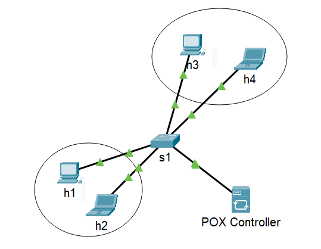

# Projeto de Mitigação de Ataques DoS e DDoS usando SDN

Este projeto implementa uma topologia SDN usando Mininet e modifica um controlador POX para mitigar ataques de negação de serviço (DoS) e negação de serviço distribuído (DDoS).

## Requisitos

- Mininet
- POX

## Topologia Lógica Equivalente (Cisco Packet Tracer)



## Instruções

### 1. Configurar e Iniciar o Controlador POX

1. Navegue até a pasta onde o controlador POX está instalado.
2. Insira o script `controlador_pox.py` dentro da pasta `/pox/ext/`.
3. Execute o controlador modificado com o seguinte comando:

    ```bash
    cd ~/pox
    ./pox.py controlador_pox


### 2. Iniciar a Topologia no Mininet

1. Navegue até a pasta onde o arquivo `topologia.py` está localizado.
2. Execute o seguinte comando:

    ```bash
    sudo python topologia.py


## Testar Mitigação de DDoS

1. Mantenha os terminais do controlador e da topologia abertos.
2. Execute o comando abaixo em um terminal para simular um ataque DoS:

    ```bash
    h1 ping -i 0.05 h2

3. Verifique o log no terminal do controlador: deve indicar que o host foi bloqueado e o pacote foi descartado.
4. Verifique o log no terminal da topologia: deve indicar que o host é inalcançável.
